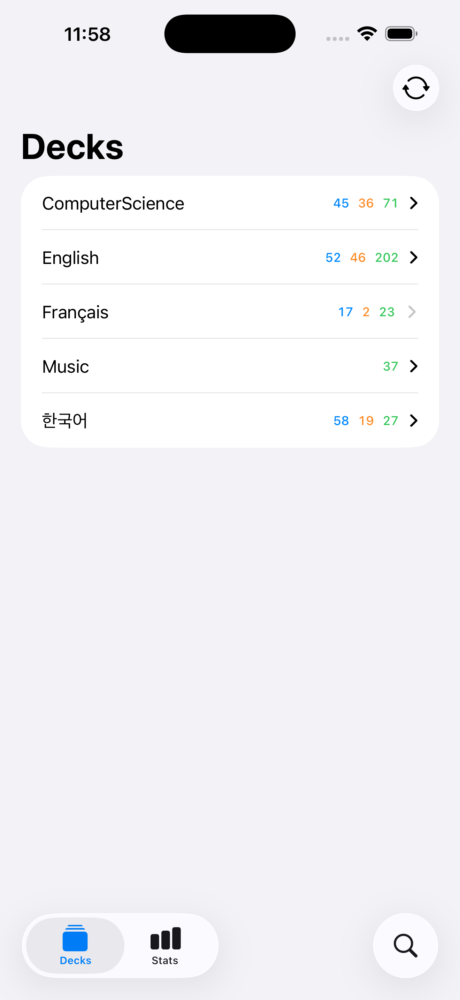
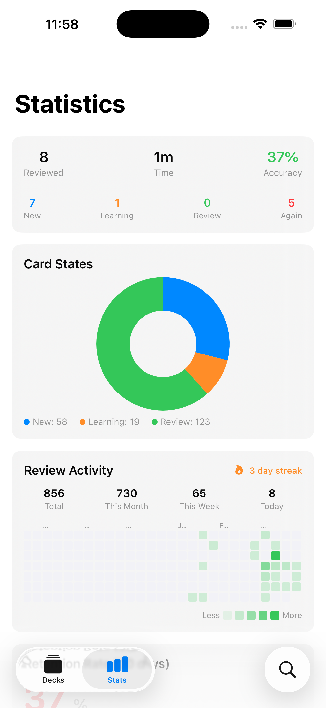

<h1 align="center">Amgi</h1>

<p align="center">
  <em>암기 (amgi) — Korean for "memorization"</em>
</p>

<p align="center">
  An open-source, offline-first Anki-compatible iOS flashcard client with sync server support.
</p>

<p align="center">
  
  
  
  
</p>

---

Amgi wraps the official [ankitects/anki](https://github.com/ankitects/anki) Rust backend via C FFI, giving you a native SwiftUI experience backed by the same battle-tested engine that powers Anki Desktop and AnkiDroid. Sync your decks with any compatible sync server (including self-hosted), study with FSRS scheduling, and keep your review history in perfect sync across all your devices.

## Features

- **Sync Server Support** -- login, sync, full upload/download, bidirectional review sync with any compatible server
- **FSRS Scheduling** -- powered by the official Rust FSRS engine, not a reimplementation
- **Card Rendering** -- Rust template engine renders cards exactly like desktop clients
- **Deck Browser** -- hierarchical deck tree with recursive `DisclosureGroup` expand/collapse, new/learn/review count badges on every node
- **Study Session** -- answer cards with Again/Hard/Good/Easy; next-interval labels shown above each button
- **Note Browser** -- search notes across all decks, deck filter chips (top-level decks auto-include subdecks), lazy-load results (50 per page)
- **Note Editor** -- edit note fields with accurate field names from the Rust notetype RPC
- **Statistics Dashboard** -- full-year review heatmap (auto-scrolls to today), streak counter, retention rate, forecast chart, card count breakdown
- **Offline-First** -- everything works offline; sync when you have a connection
- **Swift 6.2 Strict Concurrency** -- zero data races, fully actor-isolated, `Sendable` throughout
- **Multi-Theme** -- Vivid and Muted palettes, Light/Dark/Follow-System appearance, propagated through the SwiftUI environment to the app and home-screen widgets
- **Image Occlusion** -- create and edit Image Occlusion notes with an in-app canvas (rectangle, ellipse, polygon, text masks); reviewer parity with upstream Anki
- **Card Template Editor** -- edit card front/back/styling with live uncommitted preview powered by the Rust render engine
- **Settings + Maintenance** -- dedicated tab with Backup, User Files, Empty Cards, Media Check, Deck Templates, About
- **Tags + Rich Note Editor** -- inline tag management and rich field editing with audio playback and HTML preview
- **Statistics** -- retrievability histogram, optimized year-long heatmap, dual-axis tooltips for Future Due and Reviews

## Screenshots

<p align="center">
    
    
</p>

## Architecture

```
SwiftUI Views
    |
@DependencyClient structs
    |
AnkiBackend (Swift wrapper)
    |
C FFI (4 functions)
    |
Rust static library (ankitects/anki)
```

Swift owns the UI. Rust owns everything else -- database, sync, FSRS scheduling, card templates, statistics.

For the full architecture walkthrough, see **[ARCHITECTURE.md](ARCHITECTURE.md)**.

## Requirements

| Tool | Version |
|------|---------|
| iOS | 17.0+ |
| Xcode | 16.0+ |
| Rust | 1.92+ (via rustup) |
| protoc | 3.0+ |
| protoc-gen-swift | latest |
| xcodegen | latest |

## Getting Started

### 1. Clone with submodules

```bash
git clone --recursive https://github.com/antigluten/amgi.git
cd amgi
```

### 2. Install dependencies

```bash
# Rust toolchain
curl --proto '=https' --tlsv1.2 -sSf https://sh.rustup.rs | sh
rustup target add aarch64-apple-ios aarch64-apple-ios-sim x86_64-apple-ios-simulator

# Protobuf compiler and Swift plugin
brew install protobuf swift-protobuf

# Xcode project generator
brew install xcodegen
```

### 3. Build the Rust XCFramework

```bash
./scripts/build-xcframework.sh
```

This cross-compiles the Rust bridge for iOS device and simulator, then packages both into `AnkiRust.xcframework`. The first build takes several minutes; incremental builds are fast.

### 4. Generate Swift protobuf types

```bash
./scripts/generate-protos.sh
```

### 5. Open in Xcode

```bash
cd AnkiApp && xcodegen generate && cd ..
open AnkiApp/AnkiApp.xcodeproj
```

### 6. Build and Run

Select an iOS Simulator or device, then build and run (Cmd+R).

## Tech Stack

- **UI**: SwiftUI with strict concurrency (Swift 6.2, language mode v6)
- **Dependency Injection**: [swift-dependencies](https://github.com/pointfreeco/swift-dependencies) (`@DependencyClient` struct-closure pattern)
- **Backend**: [ankitects/anki](https://github.com/ankitects/anki) Rust crate via C FFI
- **Serialization**: Protocol Buffers (24 .proto service definitions)
- **Database**: SQLite (owned by Rust backend)
- **Build**: SPM for library modules, xcodegen for the app target

## License

This project is licensed under the **GNU Affero General Public License v3.0 (AGPL-3.0)** because it incorporates [ankitects/anki](https://github.com/ankitects/anki) (copyright Ankitects Pty Ltd), which is also AGPL-3.0. See [LICENSE](LICENSE) for the full license text.

The AGPL requires that if you distribute this software or run it as a network service, you must make the complete source code available under the same license.

## Contributing

Contributions are welcome. See [CONTRIBUTING.md](CONTRIBUTING.md) for guidelines, code style, and the development setup. A list of contributors is maintained in [CONTRIBUTORS.md](CONTRIBUTORS.md).

## Acknowledgments

- **[Damien Elmes](https://github.com/dae)** and the [ankitects/anki](https://github.com/ankitects/anki) contributors for the Rust backend that powers this app
- **[DreamAfar](https://github.com/DreamAfar)** for the v0.0.3 fork that contributed Image Occlusion, the multi-theme system, the Settings tab, the card template editor, retrievability stats, tag management, the rich note editor, and the GitHub Actions IPA workflow
- **[AnkiDroid](https://github.com/ankidroid/Anki-Android)** for pioneering the Rust backend bridge pattern on mobile
- **[Point-Free](https://www.pointfree.co/)** for [swift-dependencies](https://github.com/pointfreeco/swift-dependencies)
