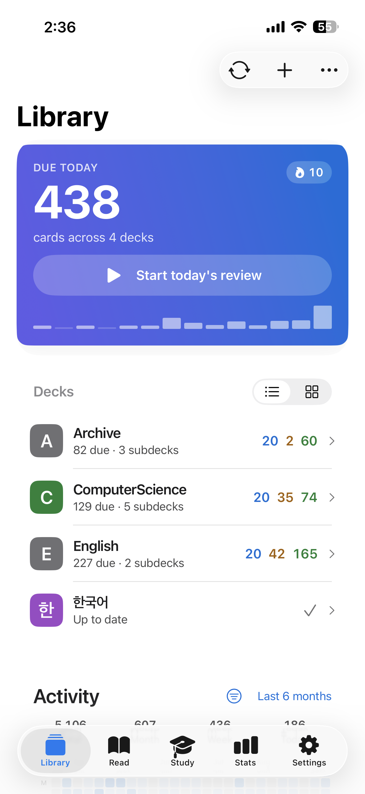
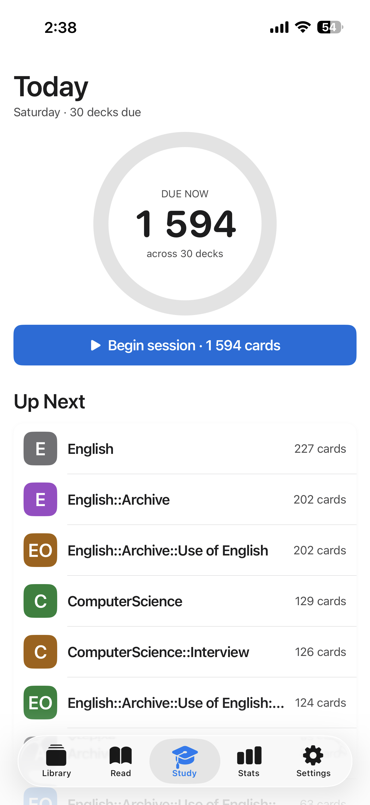
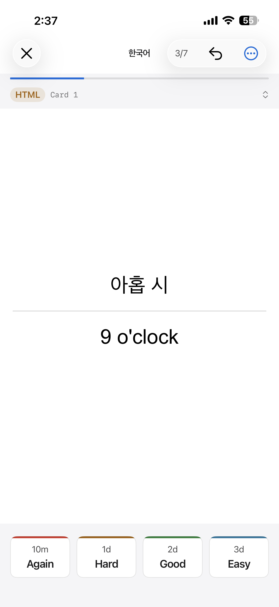
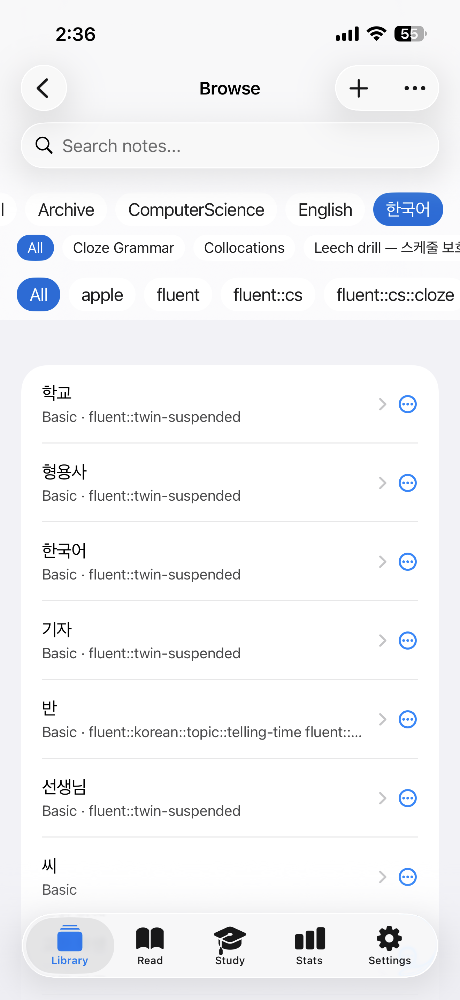
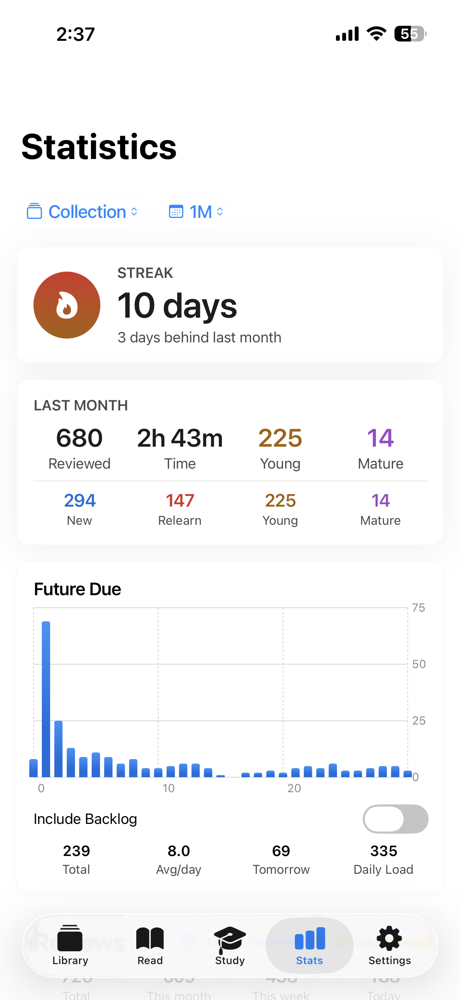

<h1 align="center">Amgi</h1>

<p align="center">
  <em>암기 (amgi) — Korean for "memorization"</em>
</p>

<p align="center">
  An open-source, offline-first Anki-compatible iOS flashcard client with sync server support.
</p>

<p align="center">
  
  
  
  
  
</p>

---

Amgi wraps the official [ankitects/anki](https://github.com/ankitects/anki) Rust backend via C FFI, giving you a native SwiftUI experience backed by the same battle-tested engine that powers Anki Desktop and AnkiDroid. Sync your decks with any compatible sync server (including self-hosted), study with FSRS scheduling, and keep your review history in perfect sync across all your devices.

## Screenshots

<p align="center">
  
  
  
  
  
</p>

<!--
  Gallery slots. Drop a PNG at the path and add it to the row above.
  assets/reader.png       — EPUB reader with a dictionary lookup popup
  assets/themes.png       — Appearance settings / theme picker
  assets/deck-options.png — Per-deck options with the FSRS simulator
  assets/widget.png       — Home-screen widget
  assets/watch.png        — watchOS companion app
-->

## Highlights

- **The real FSRS engine** — scheduling, templates, search and sync are the upstream Rust code, not a reimplementation.
- **Offline-first** — everything works without a connection; sync when you have one.
- **Any sync server** — AnkiWeb or self-hosted, with a safe merge when collections diverge.
- **Built-in EPUB reader** — with offline Yomitan-compatible dictionary lookup, so cards come from what you are reading.
- **Beyond the phone** — home-screen widgets, an Apple Watch app that runs the engine on-device, and Shortcuts/Siri actions.
- **Image occlusion, card templates, FSRS simulator** — the power-user surface, not a cut-down mobile client.

The full list is in **[Documentation/FEATURES.md](Documentation/FEATURES.md)**.

## Quick start

Install the toolchain first — Xcode 26, Rust (stable *and* nightly, for the
watchOS slice), protoc and xcodegen.
**[Documentation/BUILDING.md](Documentation/BUILDING.md)** has the exact
commands, plus how to run the tests.

```bash
git clone --recursive https://github.com/antigluten/amgi.git
cd amgi

./scripts/build-xcframework.sh            # Rust engine → xcframework
./scripts/generate-protos.sh              # protobuf → Swift types
cd AmgiApp && xcodegen generate && cd ..  # project is generated, not checked in
open AmgiApp/AmgiApp.xcodeproj
```

## Documentation

| Document | What it covers |
|---|---|
| [Features](Documentation/FEATURES.md) | Everything the app does today |
| [Building](Documentation/BUILDING.md) | Requirements, setup, build, tests, the watch target |
| [Architecture](Documentation/ARCHITECTURE.md) | Layers, package layout, design decisions |
| [Rust bridge](Documentation/RUST_BRIDGE.md) | The C FFI seam, protobuf dispatch, the build pipeline |
| [Data flows](Documentation/DATA_FLOWS.md) | Sync, study, browse, stats and widgets, RPC by RPC |
| [Code style](Documentation/CODE_STYLE.md) | Swift conventions and the module boundaries that matter |
| [Contributing](CONTRIBUTING.md) | Issues, branches, commits, pull requests |
| [Changelog](CHANGELOG.md) | What changed in each release |

`AGENTS.md` at the repo root routes a coding agent to a per-package guide
(`AmgiFeatures/AGENTS.md`, `Sources/AGENTS.md`, …) plus the reference notes in
`agents/`.

## Architecture in one diagram

```
SwiftUI feature modules (AmgiFeatures)
    |
@DependencyClient structs (AnkiClients)
    |
Service facades (AnkiServices)
    |
Typed protobuf requests (AnkiProtoBridge)
    |
AnkiBackend (Swift wrapper)
    |
C FFI (4 functions)
    |
Rust dynamic framework (ankitects/anki rslib)
```

Swift owns the UI. Rust owns everything else — database, sync, FSRS scheduling, card templates, search, import/export, statistics.

## Tech stack

- **UI**: SwiftUI with strict concurrency (Swift 6.2, language mode v6)
- **Dependency Injection**: [swift-dependencies](https://github.com/pointfreeco/swift-dependencies) (`@DependencyClient` struct-closure pattern)
- **Backend**: [ankitects/anki](https://github.com/ankitects/anki) Rust crate via C FFI
- **Serialization**: Protocol Buffers (25 .proto service definitions)
- **Database**: SQLite (owned by Rust backend)
- **EPUB**: vendored [EPUBKit](Libraries/EPUBKit) (MIT), with `hoshidicts` for Yomitan dictionaries
- **Build**: SPM for library and feature modules, xcodegen for the app, widget, and watch targets

## License

This project is licensed under the **GNU Affero General Public License v3.0 (AGPL-3.0)** because it incorporates [ankitects/anki](https://github.com/ankitects/anki) (copyright Ankitects Pty Ltd), which is also AGPL-3.0. See [LICENSE](LICENSE) for the full license text.

The AGPL requires that if you distribute this software or run it as a network service, you must make the complete source code available under the same license.

## Contributing

Contributions are welcome. See [CONTRIBUTING.md](CONTRIBUTING.md) for guidelines, code style, and the development setup. A list of contributors is maintained in [CONTRIBUTORS.md](CONTRIBUTORS.md).

## Acknowledgments

- **[Damien Elmes](https://github.com/dae)** and the [ankitects/anki](https://github.com/ankitects/anki) contributors for the Rust backend that powers this app
- **[DreamAfar](https://github.com/DreamAfar)** for the v0.0.3 fork that contributed Image Occlusion, the multi-theme system, the Settings tab, the card template editor, retrievability stats, tag management, the rich note editor, and the GitHub Actions IPA workflow
- **[AnkiDroid](https://github.com/ankidroid/Anki-Android)** for pioneering the Rust backend bridge pattern on mobile
- **[Point-Free](https://www.pointfree.co/)** for [swift-dependencies](https://github.com/pointfreeco/swift-dependencies)
